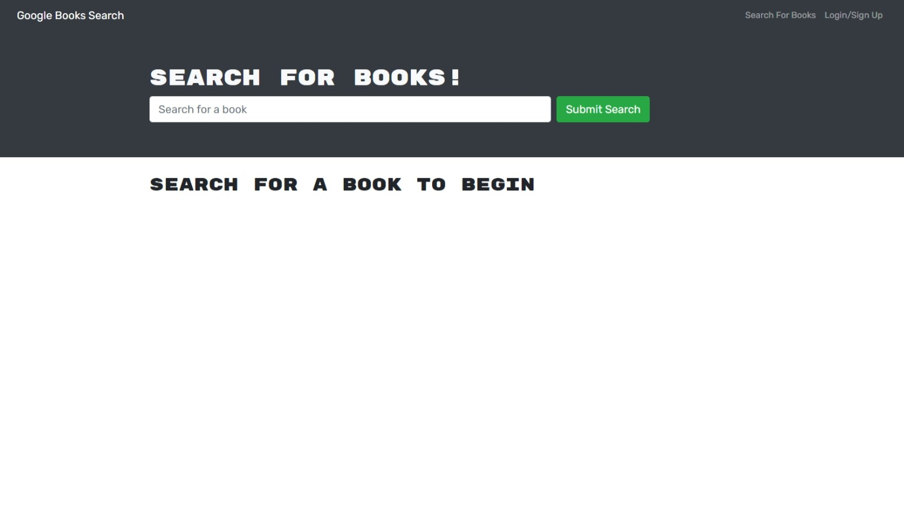

# book_search


## About Project
This web application searchs for books and save them for the user. When you first open the web application you are presented with a menue at the top that has Search for Books and Login/Signup and a search bar. When you enter your search query the search bar you're presented with several search results, each featuring a book’s title, author, description, image, and a link to that book. Once you are logged in you are able to save a book to your account and remove. 
## Built With
This web application was built using the following programming language, and tools. Programmed with javasricpt and used Express.js API for routing. For the database I used mongodb and mongoose and graphql for queries. And its deployed by using Heroku.
## Installation

  Clone the repo
   ```sh
   git clon git@github.com:missile11011/book_search.git
   ```
## Contact
Misael Reyes - misaelrey@gmail.com

Project Link: [https://book-search-25563.herokuapp.com/](https://book-search-25563.herokuapp.com/)
